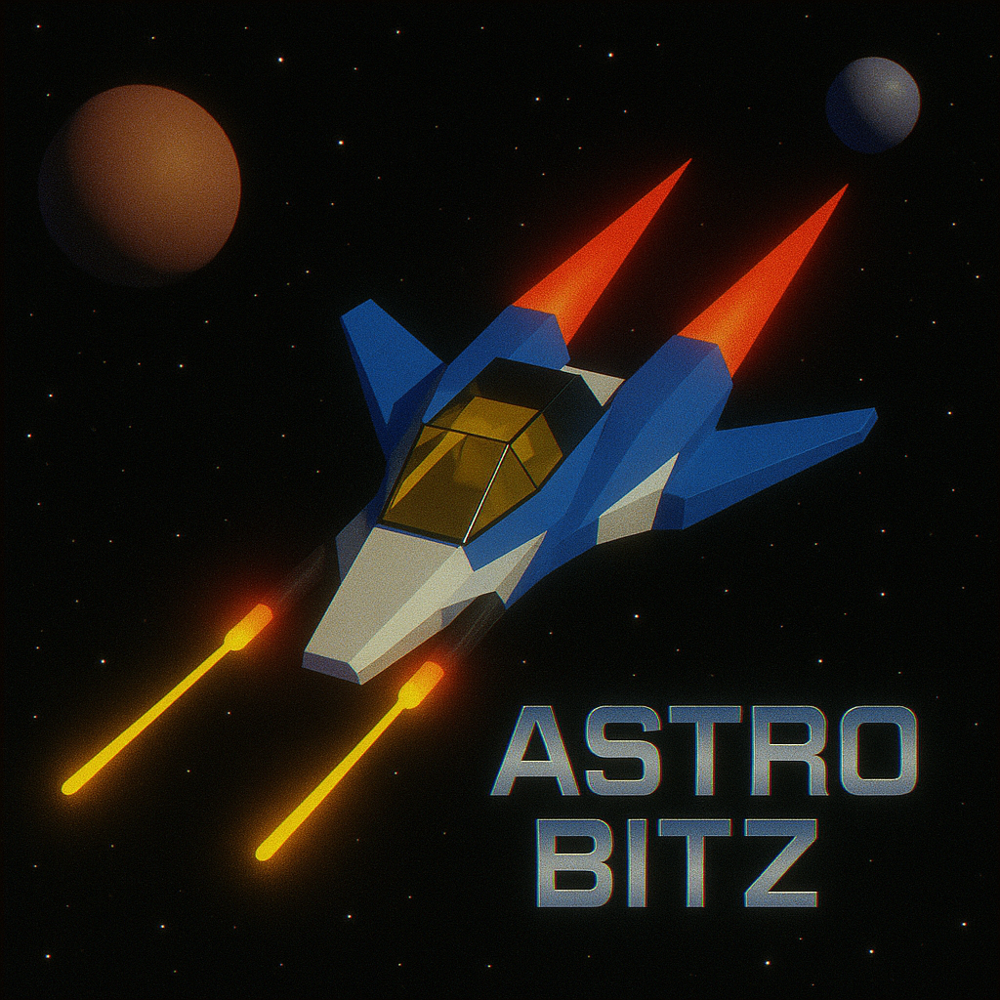

# Astro Bitz



A retro browser space shooter with escalating waves, boss battles, power-ups, achievements, and a global leaderboard.

[Play Astro Bitz](https://astrobitz.com)

## Features

- Nine enemy types with distinct movement and attack patterns
- Seven boss encounters, including multi-ship formations
- Heat-seeking missiles, bombs, shields, rapid fire, and super fire
- Escalating endless waves and pilot-rank progression
- Local achievements, high scores, and shareable score cards
- Optional global leaderboard and anonymous gameplay analytics
- Keyboard and touch controls for desktop and mobile
- Web and Cordova build targets

## Controls

| Action | Desktop | Mobile |
| --- | --- | --- |
| Move | Arrow keys or `A`/`D` | Drag left or right |
| Fire | `Space` | Automatic |
| Missile | `X` | Swipe up |
| Music | `M` | In-game control |

## Technology

- TypeScript
- PixiJS 8
- Vite
- Supabase REST API for the optional leaderboard
- Cordova for mobile packaging
- Netlify for the web deployment

## Local development

```bash
npm install
npm run dev
```

The game works without external services. To enable the leaderboard or analytics, copy the environment template and provide the relevant public client configuration:

```bash
cp .env.example .env.local
```

All `VITE_*` values are embedded in the browser build. Use only public or anonymous client credentials protected by appropriate server-side access policies.

## Build

```bash
npm run build
npm run preview
```

For a Cordova build:

```bash
./build-cordova.sh
```

The script builds the web application and can copy the generated files into `cordova-app/www/` before running the platform-specific Cordova commands.

## Project structure

```text
src/
├── game/          Game loop, entities, audio, achievements, and services
├── lib/           Anonymous analytics client
├── utils/         Shared utilities
├── leaderboard.ts Landing-page leaderboard
└── main.ts        PixiJS application bootstrap

public/            Static images and game assets
cordova-app/       Cordova wrapper configuration
docs/              Deployment, analytics, advertising, and mobile guides
```

## Documentation

- [Deployment](docs/deployment.md)
- [Mobile packaging](docs/mobile.md)
- [Analytics](docs/analytics.md)
- [Advertising](docs/ads.md)

## Privacy and backend safety

The application does not require an account. Local achievements and high scores stay in the browser. Optional analytics use an anonymous identifier, and the leaderboard stores a player-selected display name, score, wave, rank, and anonymous identifier.

The included Supabase SQL is a starting point. Before operating a public leaderboard, add abuse prevention and validate the access policies for your deployment.

Copyright © Stellan. All rights reserved.
